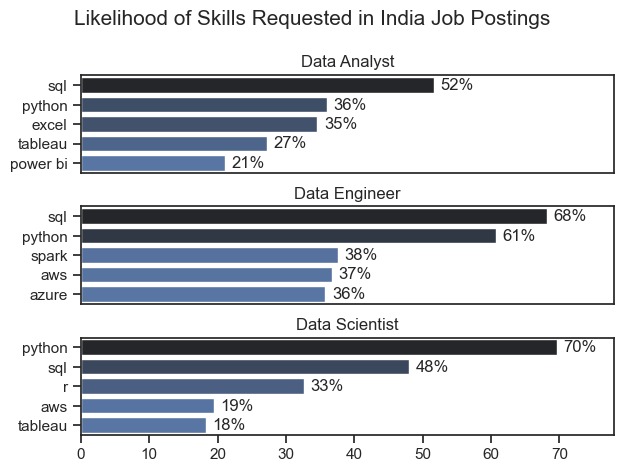
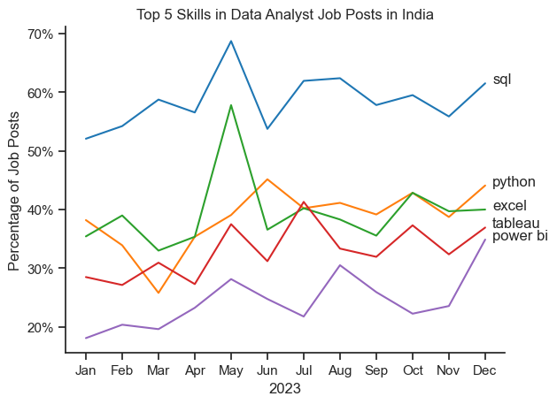

# Overview
Welcome to my deep dive into the data analytics job market, with a spotlight on data analyst roles.
This project was born out of a personal drive to better understand and navigate career opportunities in the field. It explores the most lucrative and sought-after skills that can help aspiring analysts land high-value positions.
The foundation of this analysis comes from Luke Barousse’s Python course, which offers a rich dataset covering job titles, compensation, geographic trends, and key technical skills. Using Python, I’ve built scripts to answer critical questions—like which skills are most in demand, how salaries vary across roles and regions, and where skill demand aligns with top-paying jobs in data analytics.

# The Questions

Below are the questions I want to answer in my project:

What are the skills most in demand for the top 3 most popular data roles?
How are in-demand skills trending for Data Analysts?
How well do jobs and skills pay for Data Analysts?
What are the optimal skills for data analysts to learn? (High Demand AND High Paying)

# The Analysis

Each Jupyter notebook for this project aimed at investigating specific aspects of the data job market. Here’s how I approached each question:

# 1. What are the most demanded skills for the top 3 most popular data roles?

To find the most demanded skills for the top 3 most popular data roles. I filtered out those positions by which ones were the most popular, and got the top 5 skills for these top 3 roles. This query highlights the most popular job titles and their top skills, showing which skills I should pay attention to depending on the role I'm targeting.

View my notebook with detailed steps here: [2_Skill_Demand](C:\Users\lenovo\Documents\python_project\2_skills_count.ipynb)

# Visualize Data

```python

fig, ax = plt.subplots(len(job_titles), 1 , figsize=(8, 6))
if len(job_titles) == 1:
    ax = [ax]

sns.set_theme(style='ticks')

for i, job_title in enumerate(job_titles):
    df_plot = df_skills_perc[df_skills_perc['job_title_short'] == job_title].head(5)
    sns.barplot(data=df_plot, x='skill_percent', y='job_skills', ax=ax[i], hue = 'skill_percent', palette = 'dark:b_r')
    ax[i].set_title(job_title)
    ax[i].set_ylabel(' ')
    ax[i].set_xlabel(' ')
    ax[i].set_xlim(0, 78)
    ax[i].legend().set_visible(False)

    for n, v in enumerate(df_plot['skill_percent']):
        ax[i].text(v+1 , n , f'{v:.0f}%', va='center')

    if i != len(job_titles) - 1:
        ax[i].set_xticks([])


fig.suptitle('Counts Of Top Skills in Job Postings', fontsize = 15)
fig.tight_layout(h_pad=0.5)
plt.show()
```
# Image



# Insights

- Data Analysts must master SQL (52%) and Python (36%)—these are non-negotiable. Excel (35%), Tableau (27%), and Power BI (21%) dominate the visualization space, proving that analysts are expected to turn raw data into clear, actionable insights.

- Data Engineers are the backbone of data infrastructure, with SQL (68%) and Python (61%) as their core tools. Spark (38%), AWS (37%), and Azure (36%) show that engineers are expected to build scalable systems using cutting-edge cloud and big data technologies.

- Data Scientists are driven by Python (70%) and SQL (48%), the engines behind modeling and experimentation. AWS (19%) and Tableau (18%) appear as supporting skills, but the real expectation is deep analytical thinking powered by code.

# 2. How are in demand skills trending for Data Analysts?

To find how skills are trending in 2023 for Data Analysts, I filtered data analyst positions and grouped the skills by the month of the job postings. This got me the top 5 skills of data analysts by month, showing how popular skills were throughout 2023.

View my notebook with detailed steps here:
[3_Skills_Trend](C:\Users\lenovo\Documents\python_project\Project\3_Skills_Trend.ipynb)

# Visualize Data

```PYTHON
df_plot = df_DA_percent.iloc[:,:5]
sns.lineplot(data=df_plot, dashes=False, palette="tab10")
sns.set_theme(style='ticks')
sns.despine()

from matplotlib.ticker import PercentFormatter
ax = plt.gca()
ax.yaxis.set_major_formatter(PercentFormatter(decimals=0))

for i in range(5):
    plt.text(11.2,df_plot.iloc[-1, i], df_plot.columns[i])
```
# Results


# Insights

- SQL leads consistently, peaking at 70% in May—core to data workflows.
- Python stays stable around 50%, reflecting its versatility in analytics.
- Excel spikes to 60% in June but fluctuates, showing transitional relevance.
- Tableau & Power BI hover between 25–40%, with no clear visualization leader.

# 