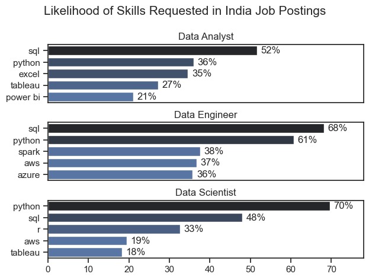
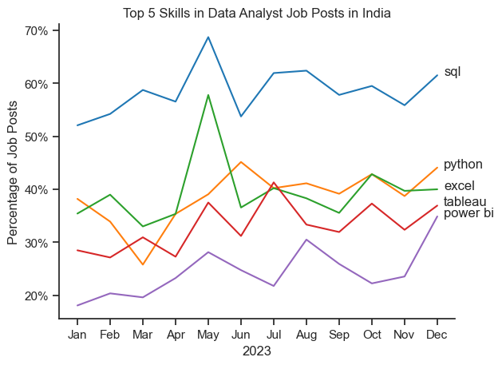
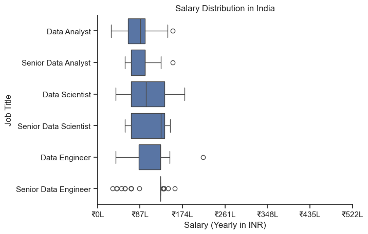
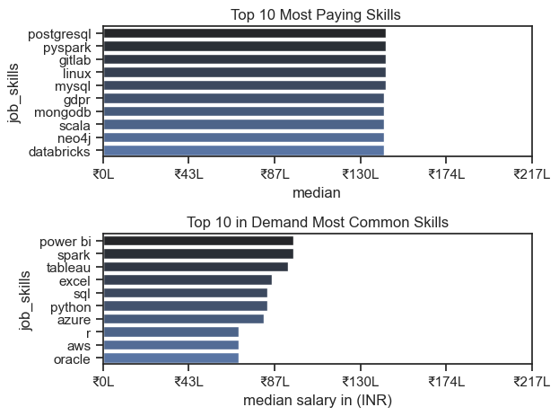
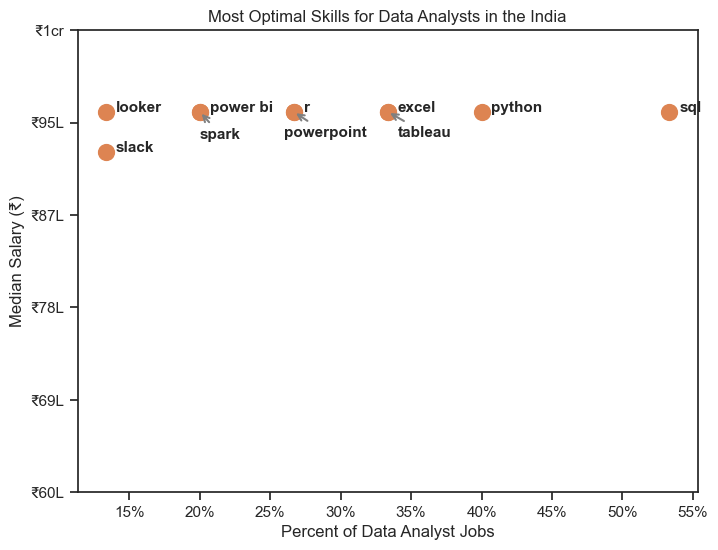
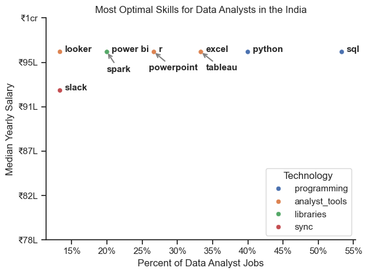

# Overview
Welcome to my deep dive into the data analytics job market, with a spotlight on data analyst roles.
This project was born out of a personal drive to better understand and navigate career opportunities in the field. It explores the most lucrative and sought-after skills that can help aspiring analysts land high-value positions.
The foundation of this analysis comes from Luke Barousse’s Python course, which offers a rich dataset covering job titles, compensation, geographic trends, and key technical skills. Using Python, I’ve built scripts to answer critical questions—like which skills are most in demand, how salaries vary across roles and regions, and where skill demand aligns with top-paying jobs in data analytics.

# The Questions

Below are the questions I want to answer in my project:

What are the skills most in demand for the top 3 most popular data roles?
How are in-demand skills trending for Data Analysts?
How well do jobs and skills pay for Data Analysts?
What are the optimal skills for data analysts to learn? (High Demand AND High Paying)

# The Analysis

Each Jupyter notebook for this project aimed at investigating specific aspects of the data job market. Here’s how I approached each question:

# 1. What are the most demanded skills for the top 3 most popular data roles?

To find the most demanded skills for the top 3 most popular data roles. I filtered out those positions by which ones were the most popular, and got the top 5 skills for these top 3 roles. This query highlights the most popular job titles and their top skills, showing which skills I should pay attention to depending on the role I'm targeting.

View my notebook with detailed steps here: [2_Skill_Demand](C:\Users\lenovo\Documents\python_project\2_skills_count.ipynb)

### Visualize Data

```python
fig, ax = plt.subplots(len(job_titles), 1)
fig.suptitle('Likelihood of Skills Requested in India Job Postings', fontsize=15)
fig.tight_layout(h_pad=.8)
plt.show()
```
### Image



*Bar graph visualizing the salary for the top 3 data roles and their top 5 skills associated with each.*

### Insights

- Data Analysts must master SQL (52%) and Python (36%)—these are non-negotiable. Excel (35%), Tableau (27%), and Power BI (21%) dominate the visualization space, proving that analysts are expected to turn raw data into clear, actionable insights.

- Data Engineers are the backbone of data infrastructure, with SQL (68%) and Python (61%) as their core tools. Spark (38%), AWS (37%), and Azure (36%) show that engineers are expected to build scalable systems using cutting-edge cloud and big data technologies.

- Data Scientists are driven by Python (70%) and SQL (48%), the engines behind modeling and experimentation. AWS (19%) and Tableau (18%) appear as supporting skills, but the real expectation is deep analytical thinking powered by code.

# 2. How are in demand skills trending for Data Analysts?

To find how skills are trending in 2023 for Data Analysts, I filtered data analyst positions and grouped the skills by the month of the job postings. This got me the top 5 skills of data analysts by month, showing how popular skills were throughout 2023.

View my notebook with detailed steps here:
[3_Skills_Trend](C:\Users\lenovo\Documents\python_project\Project\3_Skills_Trend.ipynb)

### Visualize Data

```PYTHON
df_plot = df_DA_percent.iloc[:,:5]
sns.lineplot(data=df_plot, dashes=False, palette="tab10")
sns.set_theme(style='ticks')
sns.despine()

from matplotlib.ticker import PercentFormatter
ax = plt.gca()
ax.yaxis.set_major_formatter(PercentFormatter(decimals=0))

for i in range(5):
    plt.text(11.2,df_plot.iloc[-1, i], df_plot.columns[i])
```
### Results


*Visualization Of Top Skills For Data Nerds*

### Insights

- SQL leads consistently, peaking at 70% in May—core to data workflows.
- Python stays stable around 50%, reflecting its versatility in analytics.
- Excel spikes to 60% in June but fluctuates, showing transitional relevance.
- Tableau & Power BI hover between 25–40%, with no clear visualization leader.

# 3. How well do jobs and skills pay for Data Analysts?

To identify the highest-paying roles and skills, I only got jobs in the United States and looked at their median salary. But first I looked at the salary distributions of common data jobs like Data Scientist, Data Engineer, and Data Analyst, to get an idea of which jobs are paid the most.

View my notebook with detailed steps here: [4_Salary_Analysis](C:\Users\lenovo\Documents\python_project\Project\4_Salary_Analysis.ipynb)

```python
sns.boxplot(data=df_US_top6, x='salary_year_avg', y='job_title_short', order=job_order)

ticks_x = plt.FuncFormatter(lambda y, pos: f'${int(y/1000)}K')
plt.gca().xaxis.set_major_formatter(ticks_x)
plt.show()
```
### Results


*Box plot visualizing the salary distributions for the top 6 data job titles.*

### Insights

- Senior roles offer up to 100% higher median salaries—a clear reward for experience and system-level expertise.
- Skill Premium: Data Scientists earn 40–50% more than Analysts, reflecting the value of advanced modeling and ML capabilities.
- Engineering Spread: Data Engineering roles show the widest salary range, from ₹8L to ₹50L+, driven by tech stack, domain, and company size.

 ### Highest Paid & Most Demanded Skills for Data Analysts

Next, I narrowed my analysis and focused only on data analyst roles. I looked at the highest-paid skills and the most in-demand skills. I used two bar charts to showcase these.

### Visualize Data
```python
fig, ax = plt.subplots(2, 1)  

sns.barplot(data=df_DA_top_pay, x='median', y=df_DA_top_pay.index, hue='median', ax=ax[0], palette='dark:b_r')

sns.barplot(data=df_DA_skills, x='median', y=df_DA_skills.index, hue='median', ax=ax[1], palette='light:b')

plt.show()
```
### Results

Here's the breakdown of the highest-paid & most in-demand skills for data analysts in the India:


*Two separate bar graphs visualizing the highest paid skills and most in-demand skills for data analysts in the India.*

### Insights:

- PostgreSQL, PySpark, and GitLab offer median salaries above ₹150L, despite being less commonly listed.
- Power BI, Excel, SQL, and Python dominate demand, with median salaries around ₹40–60L.
- Spark, Databricks, and AWS appear in both charts, showing strong value in both demand and compensation.

# 4. What are the most optimal skills to learn for Data Analysts?

To identify the most optimal skills to learn ( the ones that are the highest paid and highest in demand) I calculated the percent of skill demand and the median salary of these skills. To easily identify which are the most optimal skills to learn.

View my notebook with detailed steps here: [5_Optimal_Skills](C:\Users\lenovo\Documents\python_project\Project\5_optimal_skills.ipynb)

### Visualize Data
```python
from adjustText import adjust_text
import matplotlib.pyplot as plt

plt.scatter(df_DA_skills_high_demand['skill_percent'], df_DA_skills_high_demand['median_salary'])
plt.show()
```
### Results


*A scatter plot visualizing the most optimal skills (high paying & high demand) for data analysts in the India.*

### Insights:
- SQL and Python appear in 50%+ of job listings, making them essential for employability.
- Most skills cluster around a ₹95L median salary, showing consistent pay across tools.
- Looker and Slack offer ₹1Cr+ salaries but appear in <15% of roles, indicating niche, high-paying opportunities.

### Visualizing Different Techonologie

Let's visualize the different technologies as well in the graph. We'll add color labels based on the technology (e.g., {Programming: Python})

### Visualize Data

```python
sns.scatterplot(
    data=df_DA_skills_tech_high_demand,
    x='skill_percent',
    y='median_salary',
    hue='technology'
)

sns.despine()
sns.set_theme(style='ticks')
```
### Results


*A scatter plot visualizing the most optimal skills (high paying & high demand) for data analysts in the India with color labels for technology.*

### Insights:

- SQL and Python appear in 45–50% of job listings and offer salaries close to ₹95L, making them top priorities for employability and pay.
- Skills like Slack and Looker show <15% job presence and lower salaries (~₹78–80L), indicating limited but specialized use.
- Most analyst tools (Excel, Tableau, PowerPoint) cluster around ₹85–90L, showing consistent but mid-tier compensation.

# What I Learned

- Skill Demand and Salary Correlation: There is a clear correlation between the demand for specific skills and the salaries these skills command. Advanced and specialized skills like Python and Oracle often lead to higher salaries.
- Market Trends: There are changing trends in skill demand, highlighting the dynamic nature of the data job market. Keeping up with these trends is essential for career growth in data analytics.
- Economic Value of Skills: Understanding which skills are both in-demand and well-compensated can guide data analysts in prioritizing learning to maximize their economic returns.

# Challenges I Faced

This project was not without its challenges, but it provided good learning opportunities:

- Data Inconsistencies: Handling missing or inconsistent data entries requires careful consideration and thorough data-cleaning techniques to ensure the integrity of the analysis.
- Complex Data Visualization: Designing effective visual representations of complex datasets was challenging but critical for conveying insights clearly and compellingly.
- Balancing Breadth and Depth: Deciding how deeply to dive into each analysis while maintaining a broad overview of the data landscape required constant balancing to ensure comprehensive coverage without getting lost in details.

# Conclusion

This exploration into the data analyst job market has been incredibly informative, highlighting the critical skills and trends that shape this evolving field. The insights I got enhance my understanding and provide actionable guidance for anyone looking to advance their career in data analytics. As the market continues to change, ongoing analysis will be essential to stay ahead in data analytics. This project is a good foundation for future explorations and underscores the importance of continuous learning and adaptation in the data field.